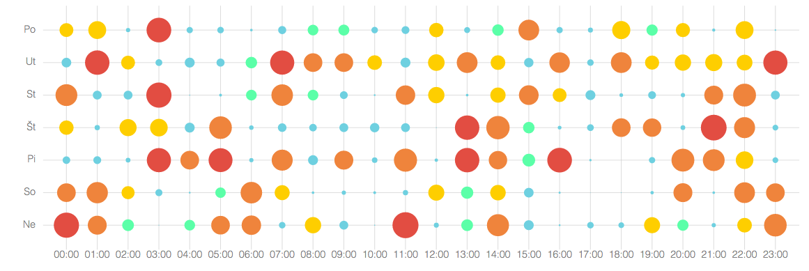

# angular-punchchart v0.1.1 [](https://travis-ci.org/pygmalios/angular-punchchart)

Punch chart component for Pygmalios platform with auto scale feature.




### Demo

Check out https://pygmalios.github.io/angular-punchchart

# Usage

We use [bower](http://twitter.github.com/bower/) for dependency management. Add
```json
"dependencies": {
    "angular-punchchart": "latest"
}
```
To your `bower.json` file. Then run

    bower install

This will copy files into your `bower_components` folder, along with its dependencies. Load the script files in your application:
```html
<script type="text/javascript" src="bower_components/angular/angular.js"></script>
<script type="text/javascript" src="bower_components/d3/d3.min.js"></script>
<script type="text/javascript" src="bower_components/d3-tip/index.js"></script>
<script type="text/javascript" src="bower_components/pygmalios/angular-punchchart.min.js"></script>
<link rel="stylesheet" href="//rawgithub.com/Caged/d3-tip/master/examples/example-styles.css">
```
```js
var myAppModule = angular.module('MyApp', ['pygmalios.punchchart']);
```
```js
angular.module('MyApp').controller('MainCtrl', function ['$scope', ($scope) {
    $scope.yLabels = ['Po', 'Ut'];
    $scope.xLabels = [
        '00:00', '01:00', '02:00', '03:00'
    ];

    $scope.data = [
        [69, 91, 25, 80],
        [60, 81, 43, 24]
    ];

    $scope.options = {
        'PUNCT_COLOR': 'red'
    };
}]);
```

```html
    <div punch-chart chart-data="data" xlabels="xLabels" ylabels="yLabels" options="options"></div>
```

### Configuration

You can set following attributes
```js
$scope.options = {
    'PUNCT_COLOR': '#62BFCE',
    'LABEL_COLOR': '#7F7F7F',
    'LINE_COLOR': '#D0D0D0',
    'FONT_SIZE': 10,
    'FONT_WEIGHT': 100
}
```

# Contributing

Contributions are welcome. Please make a pull request against canary branch and do not bump versions. Also include tests.

# Testing

We use karma and jshint to ensure the quality of the code. The easiest way to run these checks is to use gulp:

    npm install -g gulp
    npm install
    bower install
    gulp

The karma task will try to open Chrome as a browser in which to run the tests. Make sure this is available or change the configuration in `test/test.config.js`

# License

The MIT License

Copyright [Pygmalios](http://www.pygmalios.com)